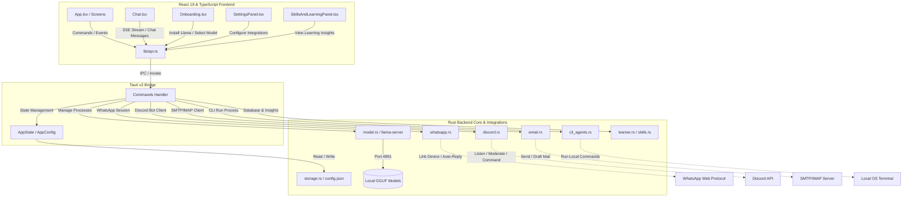

# Pern — Offline-First Local AI Desktop & Mobile Assistant

[](https://tauri.app/)
[](https://react.dev/)
[](https://www.typescriptlang.org/)
[](https://www.rust-lang.org/)
[](#multi-platform-support)
[](LICENSE)

Pern is a private, offline-first personal AI assistant and developer workspace built using **Tauri v2**, **React 19**, **TypeScript**, and **Rust**. It operates entirely locally on your machine, leveraging an embedded local Llama server (`llama-server` / `llama.cpp`) to run GGUF language and reasoning models securely. Pern ensures absolute data privacy for your conversations, projects, and automated workflows without calling external APIs or requiring an active internet connection.

---

## 📖 Table of Contents
1. [Key Features](#-key-features)
2. [Project Architecture & Dependency Mapping](#-project-architecture--dependency-mapping)
3. [Deep Integration Modules](#-deep-integration-modules)
4. [Technology Stack](#-technology-stack)
5. [Model Registry & Hardware Recommendations](#-model-registry--hardware-recommendations)
6. [Local Development & Build Instructions](#-local-development--build-instructions)
7. [GitHub SEO & Search Visibility](#-github-seo--search-visibility)

---

## ✨ Key Features

* **Offline & Private AI**: Runs a local, device-native `llama-server` instance. No external API keys are required; your data never leaves your hardware.
* **Unified Onboarding Setup**: A step-by-step setup screen that downloads, extracts, and configures optimized Llama engine binaries matching your OS.
* **Stream & Cancellation Control**: Real-time server-sent events (SSE) streaming for AI completions, with instant prompt cancellation support.
* **Skills Learner & Memory**: Tracks tool usage statistics to generate learning insights and build long-term user memory.
* **Deep Tool Ecosystem**: Connects the AI directly to your WhatsApp, Discord, workspace files, local terminal, and email inbox.
* **Multi-Platform UI**: Tailored layouts built for desktop (with system tray integration and auto-positioning) and mobile (Android viewport optimization).

---

## 📐 Project Architecture & Dependency Mapping

To fully map and design Pern, we analyzed the codebase dependencies using **Graphify**. The core architecture consists of a React 19 frontend communicating with a Rust-based Tauri v2 shell, which in turn manages an embedded `llama-server` process and various integrations.

### 🌐 System Architecture Diagram



### 🧩 Core Modules & Graphify Analysis

Through Graphify's dependency extraction, the system is organized into the following key communities:
1. **Tauri Commands & State** (`commands.rs`, `commands/`): Exposes IPC entry points (`check_llama_installed`, `download_model`, `start_llama_server`, etc.) that link UI actions to the OS backend.
2. **Onboarding UI & App Entry** (`Onboarding.tsx`, `App.tsx`): Verifies local environments, manages automatic tray positioning on desktop, and guides the user through fetching hardware-optimized `.gguf` models.
3. **App Configuration & Storage** (`storage.rs`, `AppState`): Configures user preferences, handles path settings for `.gguf` files, and manages the global state.
4. **Skills Learner & Memory** (`learner.rs`, `skills.rs`, `memory.rs`): Logs tool usage, records skill invocation statistics, and maintains a long-term memory file.
5. **Chat Logic & Models** (`chat.rs`, `chat_prompt.rs`, `model.rs`): Processes tokens sent to the frontend via web sockets and monitors the health of `llama-server`.

---

## 🔌 Deep Integration Modules

Pern extends beyond a simple chat interface by implementing dedicated tool integration modules:

### 📁 Projects Manager (`projects.rs` & `src/integrations/projects`)
* Link local developer directories and codebases directly to the assistant.
* Reads workspace structure and lets the local model analyze or modify project files under user supervision.

### 💬 WhatsApp Agent (`whatsapp.rs` & `src/integrations/whatsapp`)
* Powered by a Rust-native WhatsApp protocol implementation (`wa-rs`).
* Pair your device via QR code directly in the app.
* Set up automated triggers, message dispatching, and AI-powered auto-replies for selected contacts.

### 👾 Discord Mod & Agent (`discord.rs` & `src/integrations/discord`)
* Integrates a full Discord bot runner inside the application.
* Provides moderation commands: kick, ban, warn, mute, unmute, and message deletion.
* Automates channel responses, monitors member behavior, and dispatches DMs or channel messages.

### 💻 CLI Agents (`cli_agents.rs` & `src/integrations/cli_agents`)
* Safely executes terminal commands and runs automated developer diagnostics.
* Manages background processes, reaps finished processes, and returns logs to the chat.

### ✉️ Email Client (`email.rs` & `src/integrations/email`)
* Supports secure SMTP and IMAP connection configurations.
* Drafts, reviews, and dispatches emails directly through the AI chat prompt.

---

## 🛠️ Technology Stack

Pern leverages a high-performance stack optimized for resource efficiency and local execution:

* **Frontend Framework**: [React 19](https://react.dev/) & [TypeScript](https://www.typescriptlang.org/)
* **Build Tooling & Bundler**: [Vite](https://vite.dev/)
* **App Shell & Native APIs**: [Tauri v2](https://tauri.app/) (Rust wrapper)
* **Local Configuration**: JSON-based settings storage (`storage.rs`)
* **Async Runtime**: [Tokio](https://tokio.rs/)
* **Icons & UI Assets**: [Lucide React Icons](https://lucide.dev/)

---

## 🧠 Model Registry & Hardware Recommendations

Pern includes a pre-configured registry of optimized GGUF chat and reasoning models downloaded directly from Hugging Face:

| Model ID | Display Name | Size | Est. Memory | Recommended RAM | Best Suited For |
| :--- | :--- | :--- | :--- | :--- | :--- |
| `qwen-1.5-1.8b-chat-q4` | **Qwen 1.5 1.8B Chat Q4** | 1.13 GB | 1.1 GB | 4 GB+ | Fast reasoning & low-spec hardware (Default) |
| `qwen-2.5-1.5b-it-q4` | **Qwen 2.5 1.5B Instruct Q4** | 1.11 GB | 1.1 GB | 4 GB+ | Balanced speed and output quality |
| `qwen-2.5-7b-it-q4` | **Qwen 2.5 7B Instruct Q4** | 4.68 GB | 4.7 GB | 16 GB+ | High-quality reasoning and chat |
| `gemma-4-e2b-it-q4` | **Gemma 4 E2B Instruct Q4 (3.5B)** | 3.46 GB | 3.5 GB | 8 GB+ | Light reasoning and conversation |
| `gemma-4-e4b-it-q4` | **Gemma 4 E4B Instruct Q4 (5.4B)**| 5.41 GB | 5.4 GB | 16 GB+ | High-quality conversation and code tasks |
| `deepseek-r1-distill-qwen-1.5b-q4` | **DeepSeek R1 Distill Qwen 1.5B Q4**| 1.10 GB | 1.1 GB | 4 GB+ | Advanced reasoning & step-by-step logic |

---

## 💻 Local Development & Build Instructions

### Prerequisites
* **Node.js** (v20 or higher)
* **Rust & Cargo** (stable compiler toolchain)
* **C++ Compiler** / build tools (required by `llama.cpp` bindings if building from source)
* **Android Studio & SDK Command-line Tools** (if deploying or building for Android)

### Setup & Run
1. Clone the repository:
   ```bash
   git clone https://github.com/Parth3930/pern.git
   cd pern
   ```

2. Install dependencies:
   ```bash
   npm install
   ```

3. Codegen & Development:
   * **Tauri Desktop Dev (Windows)**:
     ```bash
     npm run tauri dev
     ```
   * **Vite Web Preview**:
     ```bash
     npm run dev
     ```

### Build Targets
* **Windows Installer**:
  ```bash
  npm run tauri build
  ```
* **Android Package (`.apk` / `.aab`)**:
  ```bash
  npm run android:build
  ```

---

## 🔍 GitHub SEO & Search Visibility

This repository is optimized for discoverability and indexability. 

### 🏷️ Recommended GitHub Topics (Tags)
To ensure Pern ranks high in search results and feed recommendations, apply the following topics in your repository settings:
`local-ai` · `offline-first` · `tauri-v2` · `react-19` · `rust-backend` · `llama-cpp` · `private-ai` · `personal-assistant` · `whatsapp-agent` · `discord-moderation` · `desktop-assistant` · `android-ai` · `llama-server` · `tokio-rust` · `developer-tools`

### 🌐 Metadata Architectures
* **Keyword-Rich Copy**: Headers and descriptions are written to rank for local LLMs, Tauri v2 wrappers, and local AI automations.
* **Open Graph (OG) & Twitter Cards**: Clean social media embeds and previews are set up inside `index.html`.
* **Semantic HTML5 & Performance**: Designed for high accessibility and efficient crawling by search engine spiders.
