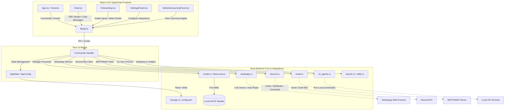

# Pern — Offline-First Local AI Desktop & Mobile Assistant

[](https://tauri.app/)
[](https://react.dev/)
[](https://www.typescriptlang.org/)
[](https://www.rust-lang.org/)
[](#multi-platform-support)
[](LICENSE)

Pern is a private, offline-first personal AI assistant and developer workspace built using **Tauri v2**, **React 19**, **TypeScript**, and **Rust**. It runs an embedded local Llama server (`llama-server` / `llama.cpp`) to execute GGUF language and reasoning models entirely on-device — no external API keys, no cloud round-trips, no data leaving your hardware.

---

## Table of Contents
1. [Key Features](#-key-features)
2. [Project Architecture](#-project-architecture)
3. [Deep Integration Modules](#-deep-integration-modules)
4. [Technology Stack](#-technology-stack)
5. [Model Registry & Hardware Recommendations](#-model-registry--hardware-recommendations)
6. [Local Development & Build Instructions](#-local-development--build-instructions)

---

## ✨ Key Features

* **Offline & Private AI** — runs a local, device-native `llama-server` instance. No external API keys, no telemetry.
* **Unified Onboarding** — a step-by-step setup screen that downloads, extracts, and configures optimized Llama engine binaries matching your OS.
* **Streamed Completions with Cancellation** — server-sent events (SSE) streaming for AI completions, with instant prompt cancellation.
* **Skills Learner & Memory** — tracks tool usage statistics to surface learning insights and a long-term user memory file.
* **Deep Tool Ecosystem** — connects the AI to WhatsApp, Discord, your workspace files, a local terminal, and email.
* **Multi-Platform UI** — tailored layouts for desktop (system tray + auto-positioning) and mobile (Android viewport optimization).

---

## 📐 Project Architecture

The core architecture: a React 19 frontend talks to a Rust-based Tauri v2 shell, which manages an embedded `llama-server` process and the integration modules.



### Core Modules

The system is organized into the following key communities:
1. **Tauri Commands & State** (`commands.rs`, `commands/`) — IPC entry points (`check_llama_installed`, `download_model`, `start_llama_server`, …) that link UI actions to the OS backend.
2. **Onboarding UI & App Entry** (`Onboarding.tsx`, `App.tsx`) — verifies the local environment, manages automatic tray positioning on desktop, and guides the user through fetching hardware-optimized `.gguf` models.
3. **App Configuration & Storage** (`storage.rs`, `AppState`) — user preferences, paths for `.gguf` files, and global state.
4. **Skills Learner & Memory** (`learner.rs`, `skills.rs`, `memory.rs`) — tool usage logs, invocation statistics, and a long-term memory file.
5. **Chat Logic & Models** (`chat.rs`, `chat_prompt.rs`, `model.rs`) — token streaming to the frontend and `llama-server` health monitoring.

---

## 🔌 Deep Integration Modules

### 📁 Projects Manager (`projects.rs` & `src/integrations/projects`)
* Link local developer directories and codebases directly to the assistant.
* Reads workspace structure and lets the local model analyze or modify project files under user supervision.

### 💬 WhatsApp Agent (`whatsapp.rs` & `src/integrations/whatsapp`)
* Powered by a Rust-native WhatsApp protocol implementation (`wa-rs`).
* Pair your device via QR code directly in the app.
* Set up automated triggers, message dispatching, and AI-powered auto-replies for selected contacts.

### 👾 Discord Mod & Agent (`discord.rs` & `src/integrations/discord`)
* A full Discord bot runner embedded in the application.
* Moderation commands: kick, ban, warn, mute, unmute, and message deletion.
* Automates channel responses, monitors member behavior, and dispatches DMs or channel messages.

### 💻 CLI Agents (`cli_agents.rs` & `src/integrations/cli_agents`)
* Safely executes terminal commands and runs automated developer diagnostics.
* Manages background processes, reaps finished processes, and returns logs to the chat.

### ✉️ Email Client (`email.rs` & `src/integrations/email`)
* Supports secure SMTP and IMAP connection configurations.
* Drafts, reviews, and dispatches emails directly through the AI chat prompt.

---

## 🛠️ Technology Stack

* **Frontend Framework** — [React 19](https://react.dev/) & [TypeScript](https://www.typescriptlang.org/)
* **Build Tooling & Bundler** — [Vite](https://vite.dev/)
* **App Shell & Native APIs** — [Tauri v2](https://tauri.app/) (Rust wrapper)
* **Local Configuration** — JSON-based settings storage (`storage.rs`)
* **Async Runtime** — [Tokio](https://tokio.rs/)
* **Icons & UI Assets** — [Lucide React Icons](https://lucide.dev/)

---

## 🧠 Model Registry & Hardware Recommendations

Pern includes a pre-configured registry of optimized GGUF chat and reasoning models downloaded directly from Hugging Face:

| Model ID | Display Name | Size | Est. Memory | Recommended RAM | Best Suited For |
| :--- | :--- | :--- | :--- | :--- | :--- |
| `qwen-1.5-1.8b-chat-q4` | **Qwen 1.5 1.8B Chat Q4** | 1.13 GB | 1.1 GB | 4 GB+ | Fast reasoning & low-spec hardware (Default) |
| `qwen-2.5-1.5b-it-q4` | **Qwen 2.5 1.5B Instruct Q4** | 1.11 GB | 1.1 GB | 4 GB+ | Balanced speed and output quality |
| `qwen-2.5-7b-it-q4` | **Qwen 2.5 7B Instruct Q4** | 4.68 GB | 4.7 GB | 16 GB+ | High-quality reasoning and chat |
| `gemma-4-e2b-it-q4` | **Gemma 4 E2B Instruct Q4 (3.5B)** | 3.46 GB | 3.5 GB | 8 GB+ | Light reasoning and conversation |
| `gemma-4-e4b-it-q4` | **Gemma 4 E4B Instruct Q4 (5.4B)**| 5.41 GB | 5.4 GB | 16 GB+ | High-quality conversation and code tasks |
| `deepseek-r1-distill-qwen-1.5b-q4` | **DeepSeek R1 Distill Qwen 1.5B Q4**| 1.10 GB | 1.1 GB | 4 GB+ | Advanced reasoning & step-by-step logic |

---

## 💻 Local Development & Build Instructions

### Prerequisites
* **Node.js** (v20 or higher)
* **Rust & Cargo** (stable compiler toolchain)
* **C++ Compiler** / build tools (required by `llama.cpp` bindings if building from source)
* **Android Studio & SDK Command-line Tools** (if deploying or building for Android)

### Setup & Run
1. Clone the repository:
   ```bash
   git clone https://github.com/Parth3930/pern.git
   cd pern
   ```

2. Install dependencies:
   ```bash
   npm install
   ```

3. Codegen & Development:
   * **Tauri Desktop Dev (Windows)**:
     ```bash
     npm run tauri dev
     ```
   * **Vite Web Preview**:
     ```bash
     npm run dev
     ```

### Build Targets
* **Windows Installer**:
  ```bash
  npm run tauri build
  ```
* **Android Package (`.apk` / `.aab`)**:
  ```bash
  npm run android:build
  ```
